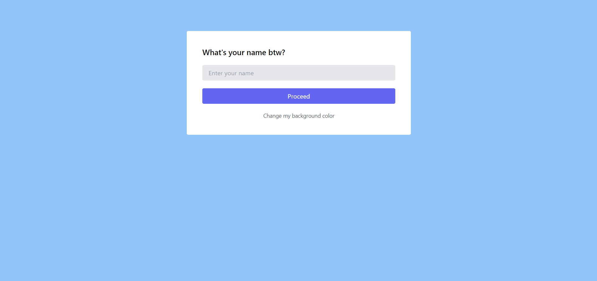
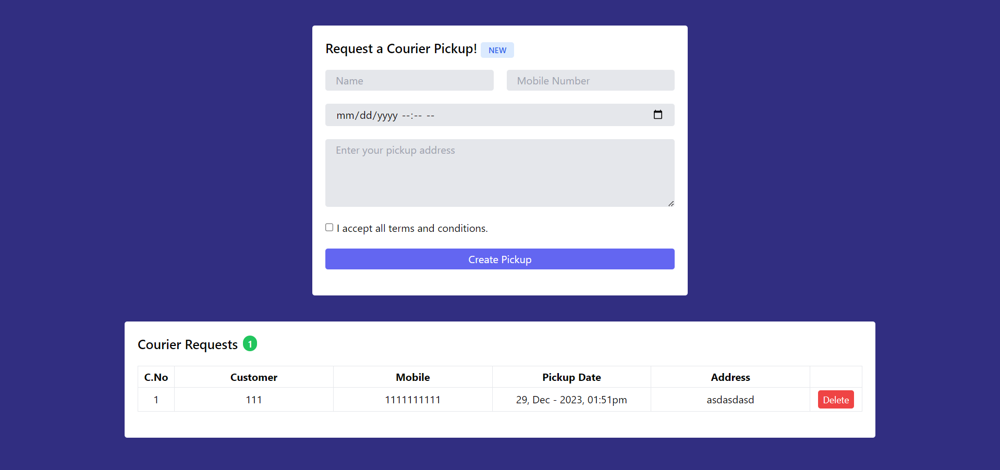
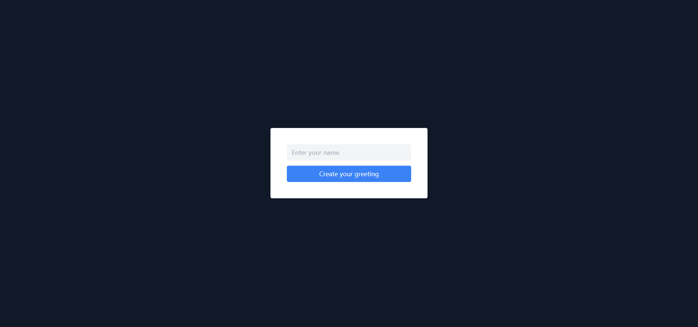
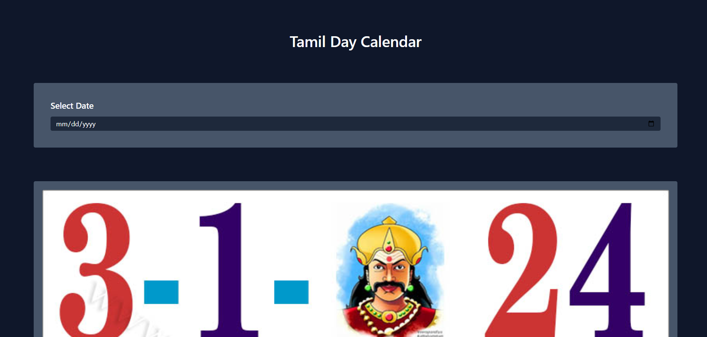
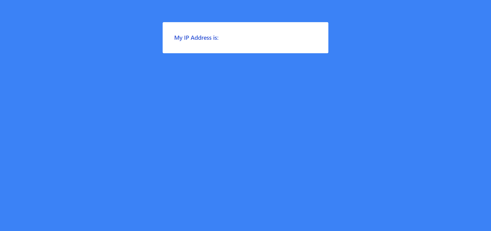

# Javascript-DOM-Projects

This repository will contain all javascript DOM projects with screenshots and source codes. Feel free to explore everything. 😊👍

## Projects

| No. | 🚀 Project Name                                      | ⏲️ Total Time |                       Source code                       | Video Link                                                                           | 🖥️ Live URL                                          |
| --- | ---------------------------------------------------- | :-----------: | :-----------------------------------------------------: | ------------------------------------------------------------------------------------ | ---------------------------------------------------- |
| #01 | [Know Your Name](#01-know-your-name-app)             |   ~ 3 Hours   |  |  | [Live Demo](https://anburocky3.github.io/know-your-name/)         |
| #02 | [Courier Pickup Form](#02-courier-pickup-form)       |   ~ 8 Hours   |  |  | [Live Demo](https://anburocky3.github.io/courier-pickup-form/)    |
| #03 | [Festival Greeting App](#03-festival-greeting-app)   |   ~ 2 Hours   |  |  | [Live Demo](https://anburocky3.github.io/festival-greeting-app/)  |
| #04 | [Tamil Day Calendar App](#04-tamil-day-calendar-app) |   ~ 2 Hours   |  |  | [Live Demo](https://anburocky3.github.io/tamil-day-calendar-app/) |
<<<<<<< HEAD
| #05 | [Get My IP WebApp](#05-get-my-ip-webapp) |   ~ 2 Hours   |  |  | [Live Demo](https://anburocky3.github.io/Get-My-IP-Web-App/) |
=======
>>>>>>> 506914bb25a3c3227f41d266fb69fdad01434540

### Screenshots

> These are the screenshots of apps we've created so far. Feel free to check.

#### 01-Know Your Name App

> **Description**
>
> Know Your Name is a simple app that greets you based on your input, and this this projct is very beginner and surface level to understand the DOM concepts and how we can dynamically make contents around the web. 

[Live Demo](https://anburocky3.github.io/know-your-name/) | [Source Code](https://github.com/anburocky3/know-your-name)

---

#### 02-Courier Pickup Form

> **Description**
>
> Courier pickup form is an intermediate app where we showcased on our live that how to save the data to localStorage and how do we implement that data from localStorage to your webapp. Not only that but also we've given you more functionalities than a simple courier pickup app. 

[Live Demo](https://anburocky3.github.io/courier-pickup-form/) | [Source Code](https://github.com/anburocky3/courier-pickup-form)

---

#### 03-Festival Greeting App

> **Description**
>
> Festival greeting is an app where you can greet yourself or based on input you give into that app. A very simple app but we use different dependencies to make this app even more distinguished compared to other festival greeting apps. 

[Live Demo](https://anburocky3.github.io/festival-greeting-app/) | [Source Code](https://github.com/anburocky3/festival-greeting-app)

---

#### 04-Tamil Day Calendar App

> **Description**
>
> Tamil day calendar is a Intermediate-level DOM project, where we need to pick a date, based on the picked date our app will show you the Tamil Day with all the necessary cultural events and vice versa.

[Live Demo](https://anburocky3.github.io/tamil-day-calendar-app/) | [Source Code](https://github.com/anburocky3/tamil-day-calendar-app)

---

#### 05-Get My IP Web App

> **Description**
>
> This small app would give you the current IP address of yours using XHRHttp request. This beginner project helps you to understand how actually API works and behind the scenes.

[Live Demo](https://anburocky3.github.io/Get-My-IP-Web-App/) | [Source Code](https://github.com/anburocky3/Get-My-IP-Web-App)

---
